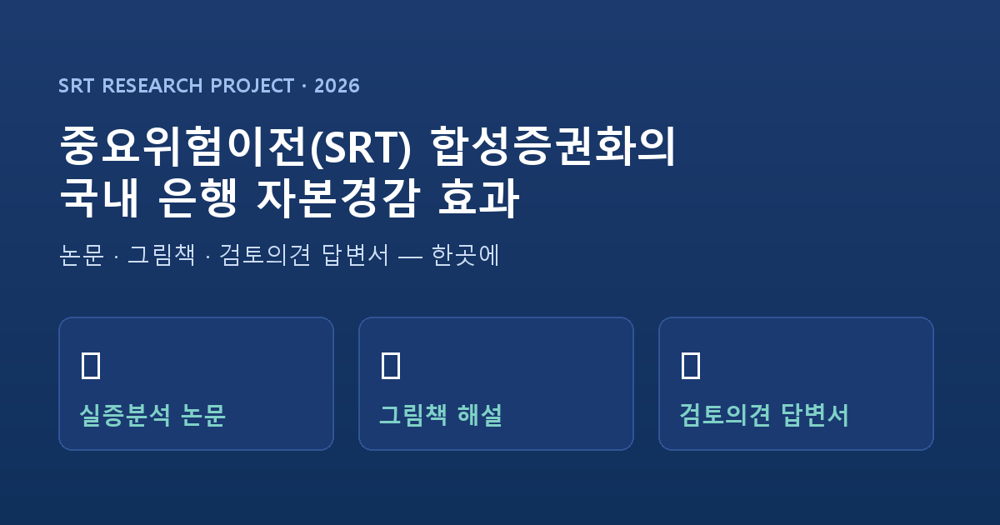

# 중요위험이전(SRT) 합성증권화 연구 — 통합 프로젝트

> 국내 은행 중요위험이전(Significant Risk Transfer, SRT)의 자본경감 효과 연구.
> **실증분석 논문 · 그림책 해설 · 금융감독원 검토의견 답변서**를 한 저장소에 통합.

## 🌐 보기
- 프로젝트 홈: **https://sdkparkforbi.github.io/srt-project/**
- 📝 검토의견 답변서: https://sdkparkforbi.github.io/srt-project/response.html
- 📄 실증분석 논문: https://sdkparkforbi.github.io/srt-project/paper.html
- 🐻 그림책 해설: https://sdkparkforbi.github.io/srt-project/storybook.html

## 📝 검토의견 답변서 (금융감독원 은행리스크검사2팀)
검토의견 8개 항목 + 서론 보완에 대한 항목별 답변:
1. 연구 범위 — 자본효과 + 시스템리스크(확장)
2. **표준방법/내부등급법 은행 구분** — 실측 기업 평균RW 36~51%(가정 75%의 절반)로 전면 교체
3. 경감률 기본·적극 차이 설명 → 이전비중 시나리오로 재구성
4. **중소기업·특수금융 대상, 이전비중 10/30/50% 시나리오** (실측: 10%→42.6%, 30%→50.3%, 50%→57.9% 경감)
5. **RWA 증감 분해** — 메자닌 매각(−) vs 우선손실 보유 1,250%(+) 구분
6. 유럽은행 실제 사례(ESRB/BCBS)와 정합성 검증
7. 신규 대출여력 추정 (ΔRWA 218조 → 약 291~545조원)
8. 시스템리스크 증가 경로와 통제방안으로 마무리

## 데이터·방법론
- 전국은행연합회 「리스크관리」 공시(내부등급법 실측 EAD·PD·LGD, 2025년말)
- 금융감독원 금융통계정보시스템(FISIS, 총RWA·자본비율)
- 바젤은행감독위원회(2026) SRT 분석보고서 / Basel CRE44 (SEC-IRBA·SEC-SA)

## 통합 안내
기존 `srt-study`(논문)·`srt-storybook`(그림책)을 본 저장소로 합쳤으며, 검토의견 답변서를 함께 수록했습니다.

---
🤖 생성형 AI 협업 제작 · 2026 · 연구 드래프트(일부 수치는 거래설계 가정 포함)
